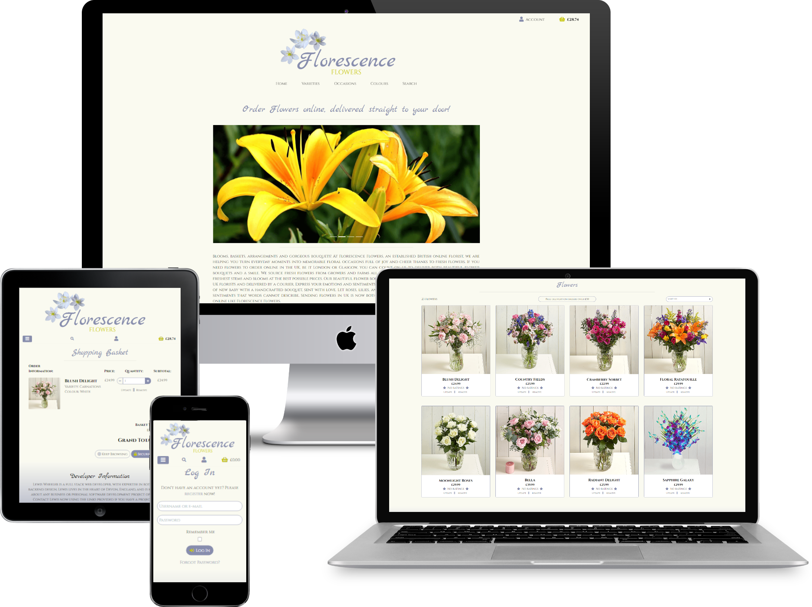
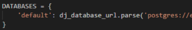
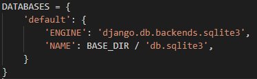
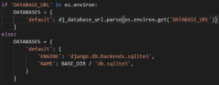
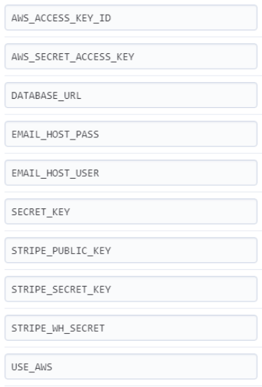

 

Thanks for visiting Florescence Flowers!

Florescence Flowers is an e-commerce florist website. Users are able to purchase gorgeous bouquets online and get them delivered straight to their door.
Users are able to follow the four basic CRUD functions, Create, Read, Update, and Delete. This means that you can register an account, write user reviews,
add user ratings, view other's reviews/ratings, edit your reviews/ratings, and delete your reviews/ratings. On top of this, the user is able to add/remove products to a shopping basket and securely checkout using the Stripe payment processing software and application programming interface.

Florescence Flowers is intended to provide great value to those who seek that special gift, for any occasion. The idea for Florescence Flowers originated 
from my love of plants and flowers. There are many plants and flowers within my household, and no matter what mood you're in, flowers always bring happiness
and joy to those who see and smell them. It is a well-known fact that flowers bring cheer to those who're celebrating a special occasion, and flowers bring
comfort to those who're grieving. Flowers are emotionally diverse, they mean something to everybody, and that is why I have chosen to create Florescence Flowers.

Please browse Florescence Flower's catalogue of beautiful bouquets, we hope that you manage to find something gorgeous to satisfy your friends, family, or work colleague! You're able to purchase a bouquet quickly without the need to register an account, but if you do register, you'll be able to leave valuable reviews and ratings. You'll also be able to keep track of your purchases through your very own profile page.

Please note that this website is purely for educational purposes only.

---

## :books: **TABLE OF CONTENTS**

1. [Live Demo](#live-demo)  

2. [UX](#ux)
    * [User Stories](#stories)
    * [Strategy](#strategy)
    * [Scope](#scope)
    * [Structure](#structure)
    * [Skeleton](#skeleton)
        * [Sketches](#sketches)
        * [Wireframes](#wireframes)
        * [Mockups](#mockups)
    * [Surface](#surface)

3. [Information Architecture](#architecture)
    * [Application Framework](#app-framework)
    * [CSS Framework](#css-framework)
    * [Database](#database)

4. [Existing Features](#existing)
    * [Navigation](#navigation)
    * [Search Flowers](#search)
    * [Sort Flowers](#sort)
    * [Home](#home)
    * [Featured Flowers](#featured)
    * [Varieties](#varieties)
        * [Carnations](#carnations)
        * [Gerbera](#gerbera)
        * [Lilies](#lilies)
        * [Roses](#roses)
    * [Occasions](#occasions)
        * [Birthday](#birthday)
        * [Celebration](#celebration)
        * [Romantic](#romantic)
        * [Sympathy](#sympathy)
        * [Thank You](#thanks)
    * [Colours](#colours)
        * [Blue](#blue)
        * [Orange](#orange)
        * [Pink](#pink)
        * [Red](#red)
        * [White](#white)
        * [Yellow](#yellow)
    * [All Flowers](#products)
    * [Flower Details](#product-detail)
    * [Basket](#basket)
    * [Checkout](#checkout)
    * [Checkout Complete](#complete)
    * [Delivery](#delivery)
    * [Emails](#email)
    * [Log In](#log-in)
    * [Register](#register)
    * [Profile](#profile)
    * [Management](#manage)
        * [Add Flowers](#add-flowers)
        * [Edit Flowers](#edit-flowers)
        * [Delete Flowers](#delete-flowers)
    * [Ratings & Reviews](#review)
        * [Add Review](#add-review)
        * [Add Rating](#add-rating)
        * [Edit Review](#edit-review)
        * [Delete Review](#delete-review)
    * [Log Out](#log-out)
    * [Other Features](#other-feat)

5. [Features left to Implement](#features-left)

6. [Technologies](#technologies)

7. [Testing](#testing)

8. [Deployment](#deployment)
    * [Deployment to Heroku](#heroku)
    * [Local Deployment](#local)

9. [Credits](#credits)
    * [Content](#content)
    * [Media](#media)
    * [Acknowledgements](#thanks)

---

## :computer: **LIVE DEMO** 

Please feel free to delve into a demo of Florescence Flowers's website.

You can live demo Florescence Flowers's website here: [Florescence Flowers](https://florescence-flowers.herokuapp.com/).

---

## :sparkles: **UX** 

The user experience (UX) is what a user of a particular product experiences when using that product. A UX designer's job is thus to create a product that 
provides the best possible user experience. We're going to provide some insight into the UX process here, focusing on the important Who, What and How?

Florescence Flowers, as previously stated, is an ecommerce florist website that's purpose is to provide users with an easy, approachable, stress-free way to 
shop for flowers, no matter what the occasion, and no matter who the recipitant. The hope is that anyone can visit, browse, purchase, and be satisfied with
their experience. Users will be able to create accounts and relay their personal experiences in the form of reviews and ratings.

Carry on below and read some of Florescence Flowers's user stories, and get a feel for what people originally wanted out of Florescence Flowers.

---

### **USER STORIES** 

| **As a...**                    | **I want to...**                        | **So I can...**                                                    |
|:-------------------------------|:----------------------------------------|:-------------------------------------------------------------------|
| Potential Shopper              | View a selection of products            | Potentially buy some products                                      |
| Potential Shopper              | Search products                         | Find a specific product I'd like to buy                            |
| Potential Shopper              | Sort products                           | Find specific prices, ratings etc.                                 |
| Potential Shopper              | View individual products                | To view prices, descriptions and ratings                           |
| Potential Shopper              | Easily register an account              | Have a personal account to view order history etc.                 |
| Potential Shopper              | Easily login or logout                  | Access my personal account                                         |
| Shopper                        | Purchase a product                      | Own a new product                                                  |
| Shopper                        | Add reviews                             | Share my experiences                                               |
| Shopper                        | Edit reviews                            | Change my review if I've made a mistake or changed my mind         |
| Shopper                        | Delete reviews                          | Remove any unwanted reviews from the site                          |
| Shopper                        | Rate products                           | Help others easily understand how good a product may or may not be |
| Shopper                        | Edit ratings                            | Change my rating if my feelings change                             |
| Shopper                        | Not have others edit/delete my reviews  | Keep my reviews personal and my own                                |
| Shopper                        | Have my own profile page                | Have my order history and delivery details in one place            |
| Shopper                        | Recieve email confirmations             | Keep track of my orders and their order numbers / details          |
| Admin                          | Add a new product                       | Have a new product on the website to sell                          |
| Admin                          | Edit a product                          | Change any product details that may change                         |
| Admin                          | Delete a product                        | Remove a product from the website that has been delisted           |
| Admin                          | Set featured products                   | Display specific products on the home page                         |

---

### **STRATEGY** 

The strategy of the Florescence Flowers website is to provide a highly attractive, user-friendly, responsive e-commerce experience. Any prospective buyer will be able to easily navigate their way to purchasing a product from start to finish. They'll then be able to share their experiences in the form of ratings and reviews and be able to keep track of their orders via email confirmations and profile pages. Our long term ambition is that Florescence Flowers builds an extensive library of products far beyond the current scope. Extra varieties and occasions will be added in the future as well as FAQs and newsletters. What's most important is that
people walk away with a feel-good vibe and are happy with their visit to Florescence Flowers.

---

### **SCOPE** 

The scope of Florescence Flowers is to provide a flawless user experience straight from the get-go. We want users to be highly engrossed in what they encounter. We want users to be attracted to the layout, the colour scheme, the ease of navigation, and the simplicity of the registration process as well as the checkout process. Ultimately we want users to return time and time again, to find a new product and to be impressed with the ease of use.

---

### **STRUCTURE** 

The structure of Florescence Flowers has been carefully thought out to provide the best possible user experience. Everything from the layout to the navigation has been
structured for a friendly, easy to use, attractive approach. Please read below for a description of each page's structure.

* Each page has a Florescence Flowers logo situated at the top center of the screen. Surrounding this, you'll find navigation links that direct the user to each
page within the Florescence Flowers website. There are seven main navigation links (Home, Varieties, Occasions, Colours, Search, Accounts, Basket), many of which being hoverable dropdown menus with additional links. When a user logs in, the Account link expands, showing additional links (Profile, Log Out), and with the loss of two links (Register, Log In). Admin users have an additional account option that is 'Manage'. Admin users will be able to add new products to the Florescence Flowers website by navigating to this link. There are eleven main pages in total, each with their own unique features. Each page contains a footer located at the bottom of the page. This footer includes developer information, copyright information, and links to the developer's social media. All pages feature a 'To Top Button' which navigates the user to the top of the page. This button is located on the bottom right-hand side of the screen.

* The Home page consists of bright colourful images and easy to read text. The Home page serves to provide information about the Florescence Flowers website and featured products.

* There are four Variety pages, each enabling the user to view specific flowers related to their respective variety. Each page consists of a navigation bar, a main header, a sort function, free delivery information, and a multitude of flower cards containing an image, a name, a price, and a rating. Admin users have the ability to edit and/or delete products from here.

* As it stands there are currently five different Occasions that our flowers relate to and they are: Birthday, Celebration, Romantic, Sympathy, and Thank You. If a user is looking for Valentine's flowers, for example, then navigating to the Romantic Occasion will display flowers such as Red Roses. These occasions have been implemented to help the user distinguish between different flowers.

* As it stands there are currently six different Colour categories that our flowers fall into and they are: Blue, Orange, Pink, Red, White, and Yellow. If a user is searching for blue flowers, for example, then navigating to the Blue Colour category will display flowers that are blue and/or have blue in them. These Colour categories have been implemented to help the user distinguish between different flowers and to also make searching more efficient.

* The Log In page features a main heading, underneath the heading you'll find a register button for those who do not currently have an account. Below this you'll find a simple form consisting of three elements: Username field, a Password field, and a Log In button. There is a 'Remember me' checkbox and a 'Forgotten Password' link.

* The Register page looks almost identical to the Log In page. It has a few additional fields. It has an email field and a confirmation email/password field. There is a 'Log In' link for those who already have an account.

* The Product Detail page displays a single product (flower) which offers the user product information and the ability to add the product to a shopping basket. Here you will find product prices, ratings, descriptions, quantity selectors and navigation / submit buttons. The submit button adds a product to the basket. The navigation links direct the user to either the previous page or the basket page. The Product Detail page also includes user review forms and displays. When a user is logged into their account they have the ability to create, edit and delete reviews and ratings. Please note that users can only edit and delete their own reviews. Posted reviews are visible to the public at any time. User ratings are accumulated into an average rating which is displayed within each product's card / Product Detail page.

* The Basket page offers the ability to see what products a user has in their basket. Product image, variety, colour, price and quantity are all shown here. The ability to update the product quantity is present here, as well as the ability to remove the item from the basket completely. A Grand Total is displayed at the bottom of the page along with any calculated delivery costs. A user can either navigate to the previous page or navigate to the checkout page.

* The Checkout page includes all of the information shown in the Basket page but it also includes a Stripe payment form. This form consists of many fields, Name, Email, Phone, Address, Bank Card Number, to name a few... Once the form has been submitted using the 'Complete Order' button, the user is directed to the Checkout Complete page.

* The Checkout Complete page holds all of a user's order information. Order Number, Order Date, User Details, Order Details, and Order Costs are all found here. This page and all of its details are available to view via the user's Profile page.

* The Profile page holds all historical orders that a user has made. Order Number, Date, Product and Cost are all shown here. A user can click on an order number and that order's Checkout Complete page will be generated. A user's delivery details can also be saved here. This makes it much quicker for a user to purchase an item without having to enter their address every time.

* The Management page, or Add Product page, is where an Admin user can add additional products to the website. Upon arrival to the page the admin user is presented with a simple form to complete. This form is comprised of six text fields, a featured checkbox, and a select image button. A cancel button and an Add Flower button are present here.

* There is a simple Log Out page that offers the user an option of whether to log out or not.

---

### **SKELETON** 

#### *Sketches* 

Florescence Flowers's website started on a piece of paper. Sketches were drawn out and a decent design was soon ready to leap into the digital world. Here are links to images of the original sketches used to help develop this project:

* [Home Page Sketch](design/sketches/ms4-sketch-home.PNG)
* [Products Page Sketch](design/sketches/ms4-sketch-products.PNG)
* [Product Detail Page Sketch](design/sketches/ms4-sketch-productDetail.PNG)
* [Basket Page Sketch](design/sketches/ms4-sketch-basket.PNG)
* [Checkout Page Sketch](design/sketches/ms4-sketch-checkout.PNG)
* [Log In Page Sketch](design/sketches/ms4-sketch-login.PNG)
* [Register Page Sketch](design/sketches/ms4-sketch-register.PNG)
* [Profile Page Sketch](design/sketches/ms4-sketch-profile.PNG)
* [Add / Edit Page Sketch](design/sketches/ms4-sketch-addEdit.PNG)

#### *Wireframes* 

After drawing up the sketches it was time to get them onto the screen. To do this, a wireframe was created using Balsamiq Wireframes 4. Wireframes are used to display what the creator ultimately envisions the website to look like, roughly! It acts as one of the first stepping stones of the journey. Here are links to images of the original sketches used to help develop this project:

* [Desktop Home Page](design/wireframes/ms4-wireframe-home.PNG)
    * [Mobile Home Page](design/wireframes/ms4-mobile-wireframe-home.PNG)
    * [Mobile Navigation](design/wireframes/ms4-mobile-navigation-wireframe.PNG)

* [Desktop Products Page](design/wireframes/ms4-wireframe-products.PNG)
    * [Mobile Products Page](design/wireframes/ms4-mobile-wireframe-products.PNG)

* [Desktop Product Detail Page](design/wireframes/ms4-wireframe-productDetail.PNG)
    * [Mobile Product Detail Page](design/wireframes/ms4-mobile-wireframe-productDetail.PNG)

* [Desktop Basket Page](design/wireframes/ms4-wireframe-basket.PNG)
    * [Mobile Basket Page](design/wireframes/ms4-mobile-wireframe-basket.PNG)

* [Desktop Checkout Page](design/wireframes/ms4-wireframe-checkout.PNG)
    * [Mobile Checkout Page](design/wireframes/ms4-mobile-wireframe-checkout.PNG)

* [Desktop Log In Page](design/wireframes/ms4-wireframe-login.PNG)
    * [Mobile Log In Page](design/wireframes/ms4-mobile-wireframe-login.PNG)

* [Desktop Register Page](design/wireframes/ms4-wireframe-register.PNG)
    * [Mobile Register Page](design/wireframes/ms4-mobile-wireframe-register.PNG)

* [Desktop Profile Page](design/wireframes/ms4-wireframe-profile.PNG)
    * [Mobile Profile Page](design/wireframes/ms4-mobile-wireframe-profile.PNG)

* [Desktop Add / Edit Page](design/wireframes/ms4-wireframe-addEdit.PNG)
    * [Mobile Add / Edit Page](design/wireframes/ms4-mobile-wireframe-addEdit.PNG)

#### *Mock Ups* 

Finally with the basics down on paper and screen, it was time to start shaping things up. After wireframes, it's time to take things a little more seriously. Enter Adobe XD. Adobe XD is a powerful piece of software designed to assist artists worldwide. More detailed designs are now progressed, and sketches etc.. are now a thing of the past! below, you will find links to the original Florescence Flowers Mock-Ups. You can clearly see how the project has evolved.

* [Desktop Home Page](design/mockups/ms4-mockup-home.PNG)
    * [Mobile Home Page](design/mockups/ms4-mobile-mockup-home.PNG)
    * [Tablet Home Page](design/mockups/ms4-tablet-mockup-home.PNG)
    * [Mobile Navigation](design/mockups/ms4-mockup-mobile-navigation.PNG)

* [Desktop Products Page](design/mockups/ms4-mockup-products.PNG)
    * [Tablet Home Page](design/mockups/ms4-tablet-mockup-products.PNG)
    * [Mobile Products Page](design/mockups/ms4-mobile-mockup-products.PNG)

* [Desktop Product Detail Page](design/mockups/ms4-mockup-productDetail.PNG)
    * [Tablet Home Page](design/mockups/ms4-tablet-mockup-productDetail.PNG)
    * [Mobile Product Detail Page](design/mockups/ms4-mobile-mockup-productDetail.PNG)

* [Desktop Basket Page](design/mockups/ms4-mockup-basket.PNG)
    * [Tablet Home Page](design/mockups/ms4-tablet-mockup-basket.PNG)
    * [Mobile Basket Page](design/mockups/ms4-mobile-mockup-basket.PNG)

* [Desktop Checkout Page](design/mockups/ms4-mockup-checkout.PNG)
    * [Tablet Home Page](design/mockups/ms4-tablet-mockup-checkout.PNG)
    * [Mobile Checkout Page](design/mockups/ms4-mobile-mockup-checkout.PNG)

* [Desktop Log In Page](design/mockups/ms4-mockup-login.PNG)
    * [Tablet Home Page](design/mockups/ms4-tablet-mockup-login.PNG)
    * [Mobile Log In Page](design/mockups/ms4-mobile-mockup-login.PNG)

* [Desktop Register Page](design/mockups/ms4-mockup-register.PNG)
    * [Tablet Home Page](design/mockups/ms4-tablet-mockup-register.PNG)
    * [Mobile Register Page](design/mockups/ms4-mobile-mockup-register.PNG)

* [Desktop Profile Page](design/mockups/ms4-mockup-profile.PNG)
    * [Tablet Home Page](design/mockups/ms4-tablet-mockup-profile.PNG)
    * [Mobile Profile Page](design/mockups/ms4-mobile-mockup-profile.PNG)

* [Desktop Add / Edit Page](design/mockups/ms4-mockup-addEdit.PNG)
    * [Tablet Home Page](design/mockups/ms4-tablet-mockup-addEdit.PNG)
    * [Mobile Add / Edit Page](design/mockups/ms4-mobile-mockup-addEdit.PNG)

---

### **SURFACE** 

The colour scheme chosen for this website offers easy on the eyes, simplistic tones. There are five main colours for Florescence Flowers. White, Eggshell, Purple, Gold and Black. White and Eggshell are the dominant colours, they are most present in the backgrounds of the webpages, text areas and product cards. Purple, Gold and Black are predominantly found within text and icons.

Chosen colours for Florescence Flowers Website:

| **Colour Name**   | **Colour RGB Code**    
| -------------     |:-------------:| 
| Purple            |#878DAD
| White             |#FFF
| Gold              |#C5C508
| Eggshell          |#FAFAF0
| Black             |#000

What really brings the Florescence Flowers' website to life is the additional colours brought to us by the actual product images themselves.
There are a multitude of products on sale, each with their own unique, colourful image. These images really stand out and give the page's character.

The images used for Florescence Flowers' logo was chosen because it relates to the theme of the website.
Images for Florescence Flowers were sourced from [PxHere](https://pxhere.com/) and [Klipartz](https://www.klipartz.com/en). 

Two fonts are used throughout Florescence Flowers's website: [Google Fonts' - Marck Script](https://fonts.google.com/specimen/Marck+Script?query=marck) and [Google Fonts' - Cinzel](https://fonts.google.com/specimen/Cinzel?query=Cinzel).
If at any point a browser cannot support these fonts, the browser will fall back on Serif and Cursive.

[Font Awesome](https://fontawesome.com/) icon graphics were used in conjunction with Bootstrap, primarily to support form fields, navigation links and submit buttons.

| **Description**   | **Font Awesome Icon**    
| -------------     |:-------------:| 
| Account           |[fas fa-user](https://fontawesome.com/icons/user?style=solid)
| Register          |[fas fa-user-plus](https://fontawesome.com/icons/user-plus?style=solid)
| Home              |[fas fa-home](https://fontawesome.com/icons/home?style=solid)
| Basket            |[fas fa-shopping-basket](https://fontawesome.com/icons/shopping-basket?style=solid)
| Log In            |[fas fa-sign-in-alt](https://fontawesome.com/icons/sign-in-alt?style=solid)
| Log Out           |[fas fa-sign-out-alt](https://fontawesome.com/icons/sign-out-alt?style=solid)
| Shop              |[fas fa-store](https://fontawesome.com/icons/store?style=solid)
| Star              |[fas fa-star](https://fontawesome.com/icons/star?style=solid)
| User              |[fas fa-user-circle](https://fontawesome.com/icons/user-circle?style=solid)
| Back Arrow        |[fas fa-arrow-circle-left](https://fontawesome.com/icons/arrow-circle-left?style=solid)
| Up Arrows         |[fas fa-angle-double-up](https://fontawesome.com/icons/angle-double-up?style=solid)
| Plus              |[fas fa-plus](https://fontawesome.com/icons/plus?style=solid)
| Minus             |[fas fa-minus](https://fontawesome.com/icons/minus?style=solid)
| Lock              |[fas fa-user-lock](https://fontawesome.com/icons/user-lock?style=solid)
| Add               |[fas fa-plus-circle](https://fontawesome.com/icons/plus-circle?style=solid)

---

## :page_facing_up: **INFORMATION ARCHITECTURE** 

### **APPLICATION FRAMEWORK** 

* [Django](https://docs.djangoproject.com/en/3.2/)

Django is a high-level Python Web framework that encourages rapid development and clean, pragmatic design. Built by experienced developers, it takes care of much of the hassle of Web development, so you can focus on writing your app without needing to reinvent the wheel. It’s free and open source. Django was chosen because of it's popularity, ease of use, and it was a prerequisite in the design of this project, according to the project brief. Django is ridiculously fast, reassuringly secure and exceedingly scalable.

### **CSS FRAMEWORK** 

* [Bootstrap](https://getbootstrap.com/docs/5.0/getting-started/introduction/)

Bootstrap is a free and open-source CSS framework directed at responsive, mobile-first front-end web development. It contains CSS and (optionally) JavaScript-based design templates for typography, forms, buttons, navigation, and other interface components. Bootstrap is the most popular CSS framework for developers to date. Bootstrap was chosen because of its attractive design capabilities, ease of use, responsiveness, and its ability to work with all modern browsers.

### **DATABASE** 

* [SQLite](https://www.sqlite.org/about.html)
* [PostgresSQL](https://www.postgresql.org/docs/)

SQLite is an embeddable open source database. SQLite is designed to be fast, portable, and reliable, whether you’re storing only kilobytes of data or multi-gigabyte blobs. One of SQLite’s greatest advantages is that it can run nearly anywhere. SQLite has been ported to a wide variety of platforms: Windows, MacOS, Linux, iOS, Android, and more. SQLite3 was used for the development of this project on my local machine because multiple processes can be attached with the same application file and can read and write without interfering with each other. It can be used with all programming languages without any compatibility issue. SQLite3's exceptional because of its versatility, speed, and power.

PostgreSQL is a powerful, open-source object-relational database system. PostgreSQL comes with many features aimed to help developers build applications, administrators to protect data integrity and build fault-tolerant environments, and help you manage your data no matter how big or small the dataset. In addition to being free and open-source, PostgreSQL is highly extensible. For example, you can define your data types, build out custom functions, even write code from different programming languages without recompiling your database. PostgreSQL was used to support the full production of the Florescence Flowers website in conjunction with Django because of its data types, integrity, reliability and extensibility.

The Florescence Flowers database consists of the following Data Models:

#### *UserProfile*

A User model used to support this project is the default standard provided by `django.contrib.auth.models`.

Var                 | Type                  | Option
--------------------|-----------------------|---------------------------------------------
user                | models.OneToOneField  | User, on_delete=models.CASCADE
phone_number        | models.CharField      | max_length=20, null=True, blank=True
street_address1     | models.CharField      | max_length=80, null=True, blank=True
street_address2     | models.CharField      | max_length=80, null=True, blank=True
town_or_city        | models.CharField      | max_length=40, null=True, blank=True
county              | models.CharField      | max_length=80, null=True, blank=True
postcode            | models.CharField      | max_length=20, null=True, blank=True
country             | CountryField          | blank_label='Country', null=True, blank=True
 

#### *Product*

The `Product` app consists of six models.

##### **Product:**

| Var                 | Type                      | Option
|---------------------|---------------------------|--------------------------------------------------
| category            | models.OneToOneField      | User, on_delete=models.CASCADE
| name                | models.CharField          | null=True, blank=True, on_delete=models.SET_NULL
| description         | models.TextField          |
| price               | models.DecimalField       | max_digits=6, decimal_places=2
| colour              | models.ForeignKey         | null=True, blank=True, on_delete=models.SET_NULL
| occasion            | models.ForeignKey         | null=True, blank=True, on_delete=models.SET_NULL
| featured            | models.BooleanField       | default=False
| avgRating           | models.FloatField         | default=0
| image               | models.ImageField         | null=True, blank=True
 

##### **Category, Colour, Occasion:**

| Name                | Var                       | Type                      | Option
|---------------------|---------------------------|---------------------------|------------------       
| Category            | name                      | models.CharField          | max_length=254
| Colour              | name                      | models.CharField          | max_length=254
| Occasion            | name                      | models.CharField          | max_length=254
 

##### **ProductReview:**

| Var                 | Type                      | Option
|---------------------|---------------------------|--------------------------------------------------
| product             | models.ForeignKey         | null=True, blank=True, on_delete=models.SET_NULL
| user                | models.ForeignKey         | User, on_delete=models.CASCADE
| content             | models.TextField          | max_length=2000, blank=True, null=True
| date_added          | models.DateTimeField      | auto_now_add=True
 

##### **ProductRating:**

| Var                 | Type                      | Option
|---------------------|---------------------------|--------------------------------------------------
| product             | models.ForeignKey         | null=True, blank=True, on_delete=models.SET_NULL
| rating              | PositiveSmallIntegerField |
| review              | models.OneToOneField      | null=True, blank=True, on_delete=models.CASCADE
 

#### *Checkout*

Within the checkout app, `Order` and `OrderLineItem` models hold the data needed for users to create and pay for their orders.

##### **Order:**

| Var                 | Type                      | Option
|---------------------|---------------------------|---------------------------------------------------------
| order_number        | models.CharField          | max_length=32, null=False, editable=False
| user_profile        | models.ForeignKey         | on_delete=models.SET_NULL, null=True, blank=True
| full_name           | models.CharField          | max_length=50, null=False, blank=False
| email               | models.EmailField         | max_length=254, null=False, blank=False
| phone_number        | models.CharField          | max_length=20, null=False, blank=False
| country             | CountryField              | blank_label='Country *', null=False, blank=False
| postcode            | models.CharField          | max_length=20, null=True, blank=True
| town_or_city        | models.CharField          | max_length=40, null=False, blank=False
| street_address1     | models.CharField          | max_length=80, null=False, blank=False
| street_address2     | models.CharField          | max_length=80, null=False, blank=False
| county              | models.CharField          | max_length=80, null=True, blank=True
| date                | models.DateTimeField      | auto_now_add=True
| delivery_cost       | models.DecimalField       | max_digits=6, decimal_places=2, null=False, default=0
| order_total         | models.DecimalField       | max_digits=10, decimal_places=2, null=False, default=0
| grand_total         | models.DecimalField       | max_digits=10, decimal_places=2, null=False, default=0
| original_basket     | models.TextField          | null=False, blank=False, default=''
| stripe_pid          | models.CharField          | max_length=254, null=False, blank=False, default=''

 

* An `Order` model instance is created before any `OrderLineItems`. `OrderLineItems` rely on the `Order` model for a `ForeignKey`.

 

##### **OrderLineItem:**

| Var                 | Type                      | Option
|---------------------|---------------------------|-------------------------------------------------------------------------
| order               | models.ForeignKey         | null=False, blank=False, on_delete=models.CASCADE
| product             | models.ForeignKey         | null=False, blank=False, on_delete=models.CASCADE
| quantity            | models.IntegerField       | null=False, blank=False, default=0
| lineitem_total      | models.DecimalField       | max_digits=6, decimal_places=2, null=False, blank=False, editable=False

 

* An `OrderLineItem` instance is created for each unique product in the users basket, linking a users existing `Order`, product and quantity the user elects to purchase

 

## :page_facing_up: **EXISTING FEATURES** 

In computer programming, create, read, update, and delete (CRUD) are the four basic functions of persistent storage. Florescence Flowers relies heavily on this concept. Users can add reviews/ratings, view products, reviews & ratings, edit reviews/ratings, and delete reviews/ratings. Admin users are also able to add, edit and delete products. Within the information below, you'll find how CRUD has been used and why it has been used. Not to mention many more features.

### **NAVIGATION** 

Each page features a top navigation bar which enables the user to navigate to most pages within the Florescence Flowers website.

* The main navigation bar, located at the top of the screen, consists of five main links: `Home`, `Varieties`, `Occasions`, `Colours`, and `Search`. At the top right-hand side of the screen, there are two additional links: `Account` and `Basket`.

* `Varieties` has five sub-links: `All Flowers`, `Carnations`, `Gerbera`, `Lilies`, and `Roses`.

* `Occasions` has five sub-links: `Birthday`, `Celebration`, `Romantic`, `Sympathy`, and `Thank You`.

* `Colours` has six sub-links: `Blue`, `Orange`, `Pink`, `Red`, `White`, and `Yellow`.

* The Account navigation link has different options depending on whether the user is logged in or logged out. If logged out, the `Log In` & `Register` links are available. If logged in, the `Profile` & `Log Out` links are available. Admin users have an additional link: `Manage`.

* The `Basket` link is displayed in the form of a Font Awesome icon and a price display.

* Florescence Flowers has a highly responsive design meaning that the website displays perfectly on a mobile device. When under 992px the top navigation bar transforms into a side navigation bar which is displayed when the user clicks on the menu button. The menu button is displayed on the left-hand side of the screen. It has a hamburger menu icon.

* Located at the bottom right-hand side of the screen there is a 'To Top Button' which when clicked, automatically takes the user back to the top of the screen. When at the top of the screen, this button disappears. It only reappears when the user scrolls down.

* Throughout the website there are multiple buttons that divert the user to different pages. The Log In page has a Register button, and likewise, the Register page has a Log In button. Most pages have a return/cancel button so that users can navigate back to where they came from. Each page has a button that clearly moves the user to the next stage in the purchasing process. If at any point the user wants to return to the home page, the `Home` link is available at all times.

* The footer has two links that take the user to two separate external websites. These link to the developer's social profiles within GitHub and LinkedIn.

 

### **SEARCH FLOWERS** 

* The `Search` feature is a very handy tool that is sure to be of great benefit to users. A user can type anything they wish into the search bar and the products related to the search data will be generated. Depending on what the user types, depends on what is displayed on this page. If the searched words correlate with anything in a product's title or description, that product will be displayed. If there are no search results, the page will indicate that there were zero results found. This short message appears at the left-hand side of the screen. The search bar is present within the main navigation bar.

### **SORT FLOWERS** 

* The `Sort` feature is also a very handy tool that is going to be highly beneficial to the user. Whilst on any product page, located to the right-hand side of the screen, the user will find a `Sort` dropdown box. A user can select from a multitude of different options: `Price`, `Rating`, `Name`, `Variety`, `Occasion`, and `Colour`. The user has the option of choosing whether to sort via Ascending order or Descending order. Once an option has been chosen, products are populated on the page, depending on what choice was made.

### **HOME PAGE** 

* The Home page is primarily used for the display of information to the user. The Home page gives an explanation about Florescence Flowers.

* It includes an animated image carousel.

* It displays `Featured Flowers` which can be managed by the site admin user.

* It includes a Shop Now button which directs the user to the All Flowers page.

* Home page is fully responsive.

### **FEATURED FLOWERS** 

* Featured flowers are shown on the Home page. Featured flowers are chosen by the admin user and are primarily displayed to promote a specific product. The admin user has the ability to change these featured flowers at any given time via the `Update` product page. The update link is present within each of the product cards as long as the admin user is logged in.

### **VARIETIES** 

There are four main varieties of flowers found on the Florescence Flowers website.

#### *Carnations* 

* When a user clicks on the `Carnations` link, all flowers that belong to the Carnation family are displayed.
* More information about Carnations can be found [here](https://en.wikipedia.org/wiki/Dianthus_caryophyllus).

#### *Gerbera* 

* When a user clicks on the `Gerbera` link, all flowers that belong to the Gerbera family are displayed.
* More information about Gerbera can be found [here](https://en.wikipedia.org/wiki/Gerbera).

#### *Lilies* 

* When a user clicks on the `Lilies` link, all flowers that belong to the Lily family are displayed.
* More information about Lilies can be found [here](https://en.wikipedia.org/wiki/Lilium).

#### *Roses* 

* When a user clicks on the `Roses` link, all flowers that belong to the Rose family are displayed.
* More information about Roses can be found [here](https://en.wikipedia.org/wiki/Rose).

### **OCCASIONS** 

There are currently five occasions for which a user may want to purchase flowers.

#### *Birthday* 

* When a user clicks on the `Birthday` link, flowers that may be given for that occasion are displayed.

#### *Celebration* 

* When a user clicks on the `Celebration` link, flowers that may be given for that occasion are displayed.

#### *Romantic* 

* When a user clicks on the `Romantic` link, flowers that may be given for that occasion are displayed.

#### *Sympathy* 

* When a user clicks on the `Sympathy` link, flowers that may be given for that occasion are displayed.

#### *Thank You* 

* When a user clicks on the `Thank You` link, flowers that may be given for that occasion are displayed.

***Please note that a user is not bound to these occasions. If a user wishes to purchase flowers within a certain occasion, for a different occasion, this is absolutely fine.***

### **COLOURS** 

There are six main colours found on the Florescence Flowers website. Although there may be other colours within the bouquets, these are the six main colours found.

#### *Blue* 

* This category is predominantly made up of blue flowers. When the `Blue` link is selected, all flowers containing the colour blue will be displayed.

#### *Orange* 

* This category is predominantly made up of orange flowers. When the `Orange` link is selected, all flowers containing the colour orange will be displayed.

#### *Pink* 

* This category is predominantly made up of pink flowers. When the `Pink` link is selected, all flowers containing the colour pink will be displayed.

#### *Red* 

* This category is predominantly made up of red flowers. When the `Red` link is selected, all flowers containing the colour red will be displayed.

#### *White* 

* This category is predominantly made up of white flowers. When the `White` link is selected, all flowers containing the colour white will be displayed.

#### *Yellow* 

* This category is predominantly made up of yellow flowers. When the `Yellow` link is selected, all flowers containing the colour yellow will be displayed.

### **ALL FLOWERS** 

* All flowers are displayed on screen, each within a card. Each card has an image, a name, a price, and a rating. Admin users have two additional links: `Update` and `Remove`. These links can either change the flowers' details or remove them from the database completely. A user can simply click on any card to direct them to the product detail page.

* To the left, there is a flower counter. This counter informs the user how many flowers are currently on the page.

* Within the middle of the page, there is a note telling the user that there is free delivery over a specified amount spent.

* Located to the right is the `Sort` dropdown selection box.

### **FLOWER DETAILS** 

* Displays one single product. Image, Name, Price, Description, Rating - all found here.

* Admin users can `Update` and `Remove` product from this page.

* Users can adjust the quantity of flower bouquets they wish to add to their basket using a simple quantity form.

* Users can `Add to Basket`, `Go Back`, or go to `Basket` by clicking on the available buttons.

* Free delivery notice is shown.

* Accepted payment method information is shown.

* Logged in users can leave product reviews here.

* Logged in users can rate products here.

* Logged in users can edit/delete their own reviews/ratings.

* If no reviews are present, a simple message is displayed informing the user.

### **BASKET** 

* The `Basket` page shows all products that a user has chosen for a possible purchase.

* Image, name, variety, colour and price are all shown here.

* Users can adjust the product quantity via a quantity field.

* Users can remove the product completely from the basket.

* Subtotals for products are shown.

* Delivery cost is calculated and shown.

* Grand total is calculated and shown.

* Users can navigate to checkout or return to all products page.

### **CHECKOUT** 

* The `Checkout` page shows all products that a user has chosen for a possible purchase.

* Image, name, variety, colour and price are all shown here.

* Subtotals for products are shown.

* Delivery cost is calculated and shown.

* Grand total is calculated and shown.

* Stripe payment form is present. Users can enter personal & credit details here.

* Save delivery info checkbox is present. This saves delivery info to the user's Profile page.

* Warning message to the user stating grand total will be charged to their card is present.

* Update Basket button returns the user to the Basket page.

* Complete Order button will process the order and take payment from the user's card. The Checkout Complete page will be rendered.

* An email will be sent to the user upon completion. This email holds all relevant order information.

### **CHECKOUT COMPLETE** 

* The Checkout Complete page holds all information relating to a completed order.

* The user will find Order Number, Date-Time, Delivery Info, Product Info, and Grand Totals.

* There is a message to the user about how Florescence Flowers delivers their products.

* There is a link that takes the user back to the All Flowers page.

* If a user if accessing a historical order via their profile page, the all flowers link will instead be a profile link.

* All information found on the checkout complete page can be found in an email sent to the user upon order completion.

### **DELIVERY** 

* Free delivery threshold is set to £30.

* 15% of the order total will be added to grand total if under the delivery threshold.

* A message informing users how much to spend to receive free delivery is found in success toasts when a user adds a product to basket.

### **EMAILS** 

* An email is sent to the email address provided when a user makes a purchase.

* An email is sent to the email address provided when a user registers an account.

* An email is sent to the email address provided when a user requests a password reset.

### **LOG IN** 

* A simple login form is present with username and password fields.

* Log in button present which logs the user into their account and renders the Home page.

* Link to the register page is present for those who do not have accounts.

* Remember me button for remembering user account.

* Forgotten password link renders password reset page.

### **REGISTER** 

* A simple login form is present with username, email, and password fields.

* Link to log in page is present for those who already have accounts.

* Register button present to submit the form.

### **PROFILE** 

* Unique heading containing the user's username is located at the top of the page.

* User's delivery information is located to the left. All fields are editable and there is a submit button to save.

* User's historical purchases are located to the right. Order number, date, product and cost of all purchased products are found here.

* User is able to click on Order Number to render Checkout Complete page which details the complete order.

### **MANAGEMENT** 

As an Admin user, Admins are able to add new products to the website, they're able to edit any current product, and they're able to completely remove any product from the website. Not just anybody can be an admin. Admin rights are only given to people involved in the management and development of Florescence Flowers.

#### *Add Flowers* 

* One of the main CRUD functionalities.

* The `Add Flowers` or, `Manage` page consists of a simple form. There are multiple fields for the admin to fill out.

* Category, Name, Description, Price, Colour, and Occasion are all text / select fields.

* Featured is a simple checkbox. This adds this specific flower to the `Featured` section located on the Home page.

* There is a `Select Image` button that enables the admin to search their local computer and upload an image to the site.

* The admin can either cancel adding a product or they can add the product to the website using the `Add Flower` button.

* If no image is selected, a default "No Image" image will be displayed.

#### *Edit Flowers* 

* One of the main CRUD functionalities.

* The `Edit Flower` functionality is exactly the same as the `Add Flower` functionality. Please see above.

* The only difference is that when the edit page is loaded, fields will be auto-populated with the information of the selected products. This information is then editable and can be saved to be permanently changed within the database/website.

#### *Delete Flowers* 

* One of the main CRUD functionalities.

* The admin user has the ability to completely remove any product from the database/website.

* Delete, or `Remove` buttons are located within the cards found in the products page and also within the product details page.

* Clicking the `Remove` link will prompt a modal message to appear. The user can cancel or confirm the deletion.

* Please be warned that once a product is deleted, you cannot get it back.

### **RATINGS & REVIEWS** 

Users who have registered an account can leave product reviews and ratings. This allows any member of the public to get an insight into what other people think about a specific product. This can ultimately help someone decide whether or not to purchase a product. Leaving reviews/ratings also offers the user interactivity, this can lead to the user experiencing elevated enjoyment.

#### *Add Review* 

* One of the main CRUD functionalities.

* Located within the product detail page is a review section.

* A text field allows the user to enter a review for publication on the website under that specific products' page.

* An `Add Review` button allows the user to submit their review.

* Reviews can only be added if the user is logged in with a registered account.

* When a review is posted, the review is added at the bottom of the product detail page.

* Username, Time, Date, Rating and Review will be displayed.

* If the user who posted is logged in, there will be a delete icon and an edit icon. These icons allow the user to either edit or delete their review.

#### *Add Rating* 

* One of the main CRUD functionalities.

* A rating dropdown box allows a user to select a rating from one to five, five being the highest rating.

* Once submitted the rating is shown below with all other review information, as stated above.

* User ratings for each product are calculated into an average rating. This average rating is then displayed within each product's card/product detail page.

* Ratings can only be added if the user is logged in with a registered account.

* Ratings can be edited via the edit function. Please see below.

* Ratings are shown in the form of Font Awesome Icons. The Star icon to be precise.

#### *Edit Review* 

* One of the main CRUD functionalities.

* Users who create reviews can edit their review. Users can change the text content or their product rating.

* If the user clicks on the edit icon, a new text window appears, as does a rating dropdown box and a submit button.

* Reviews can only be edited if the user is logged in with a registered account.

* Reviews can only be edited by the original author.

#### *Delete Review* 

* One of the main CRUD functionalities.

* Users who create reviews can delete their review.

* A user can only delete their review and their rating, not one or the other.

* Clicking the delete icon will prompt a modal message to appear. The user can cancel or confirm the deletion.

* Deletion is permanent. Please delete with caution.

* Reviews can only be deleted if the user is logged in with a registered account.

* Reviews can only be deleted by the original author.

### **LOG OUT** 

When navigating to the `Log Out` button within the Account menu, once clicked, the Log Out page will be rendered. This is a simple page with two buttons. Click `No` to revert back to the Home page and remain logged in, or click `Yes` to log out of your account and revert to the Home page. Once logged out you will not be able to access your Profile page and you will not be able to leave reviews/ratings. Additionally, admin users will not be able to manage products.

### **OTHER FEATURES** 

Defensive programming has been put in place so users cannot access specific pages if they are not logged in. If for example, if a user is on their profile page and then logs out using the logout button, if they were to click their browser's back button, they wouldn't be able to access their profile page. The login page automatically renders instead. The same applies if you were to copy and paste a URL into the search box and/or go through your search history. You will only be able to see your pages if you are logged in.

 

---

 ## :pencil2: **FEATURES LEFT TO IMPLEMENT** 

Florescence Flowers is a big project, and although we are happy with everything that has been done to date, there are still multiple features that are yet to be
implemented. In the near future we hope to implement the following:

* More varieties - Orchids, Tulips, Peonies, Dahlias.
* More Occasions - Weddings, Funeral, Mother's Day, Winter Holiday.
* More Colours - Purple, Green.
* Social Sharing - Users can share their favourite flowers via Facebook, Instagram, and WhatsApp.
* Reversing Deletion - Deleted products to be recovered in the event of human error.
* Frequently Asked Questions
* Newsletter

---

## :cd: **TECHNOLOGIES USED** 

#### *Languages* 

1. [HTML](https://html.spec.whatwg.org/multipage/)

    * The building blocks to everything that is code! Used to create the foundations of Florescence Flowers's website.

2. [CSS](https://www.w3.org/Style/CSS/)

    * Who's got style? Used to style Florescence Flowers's HTML code.

3. [JavaScript](https://developer.mozilla.org/en-US/docs/Web/JavaScript)

    * Let's get dynamic! Used to bring life into Florescence Flowers's code.

4. [Python](https://www.python.org/)

    * The brains behind it all. Used for backend development and database handling.

#### *Libraries* 

1. [Bootstrap](https://materializecss.com/)

    * Used for Bootstraps's grid system, Navigation, mobile responsiveness etc...

2. [Font Awesome](https://fontawesome.com/start)

    * Used to provide quality icons for Florescence Flowers's forms, buttons, and footer.
    
3. [Google Fonts](https://fonts.google.com/)

    * Used to change the font throughout Florescence Flowers's whole website.

4. [jQuery](https://jquery.com/)

    * Used to manipulate the DOM and bring life to Florescence Flowers.

5. [Hover.css](https://ianlunn.github.io/Hover/)

    * Used to provide subtle animation to buttons and links.

#### *Tools* 

1. [GitHub](https://github.com/)

    * A code hosting platform for version control and collaboration. It lets you and others work together on projects from anywhere.

2. [GitPod](https://www.gitpod.io/docs/)

    * A cloud-based integrated development environment (IDE) that lets you write, run, and debug your code with just a browser.

3. [Git](https://git-scm.com/)

    * A free and open source distributed version control system designed to handle everything from small to very large projects with speed and efficiency.

4. [AWS S3 Bucket](https://aws.amazon.com/) 

    * Provides a secure cloud based repository in storage for website images.

5. [Django](https://www.djangoproject.com/) 

    * High-level Python Web framework that encourages rapid development and a clean, pragmatic design.

6. [Django-Heroku](https://pypi.org/project/django-heroku/) 

    * Enabling improved deployment of django projects on heroku.

7. [Django-Storages](https://django-storages.readthedocs.io/en/latest/) 

    * Custom storage backending with Django to work with AWS S3 and Boto3

8. [Stripe](https://stripe.com/gb) 

    * A payment platform to validate debit and credit card payments securely.

9. [Gunicorn](https://pypi.org/project/gunicorn/) 

    * Enables deployment of the Django project to heroku via UNXI WSGI HTTP Server

10. [Pillow](https://pillow.readthedocs.io/en/stable/) 

    * A python imaging library enabling image files to store in database.

11. [PIP](https://pip.pypa.io/en/stable/installing/) 

    * Enabling installation of tools and packages required for this project to function correctly.

12. [psycopg2](https://pypi.org/project/psycopg2/) 

    * A PostgreSQL production database adapter for Python.

13. [Boto3](https://boto3.amazonaws.com/v1/documentation/api/latest/index.html) 

    * Enables the creation, configuration and management of AWS S3.

14. [Balsamiq Wireframes 4](https://balsamiq.com/)

    * Used to create Florescence Flowers's Wireframes.

15. [Adobe XD](https://www.adobe.com/uk/products/xd.html)

    * Used to create Florescence Flowers's logos and Mock Ups.

#### *Hosting* 

1. [Heroku](https://www.heroku.com/)

    * Used to host the deployed application.

---

## :test_tube: **TESTING** 

Testing to go here.

---

## :airplane: **DEPLOYMENT** 

[Heroku](https://www.heroku.com/) has been used to deploy the Florescence Flowers website. Developers use Heroku to deploy, manage, and scale modern apps. 
The platform is elegant, flexible, and easy to use, offering developers the simplest path to getting their apps to market. The Heroku experience provides services, tools, workflows, and polyglot support — all designed to enhance developer productivity.

### **DEPLOYMENT TO HEROKU** 

1. Go to [Heroku.com](https://www.heroku.com/) and create an account.
2. Create a new app within your newly created Heroku account.
3. Select the region closest to you.
4. Click the `Resources` tab, find `Add Ons`, search for and select `Heroku Postgres`. Then select the free plan.
5. Within your IDE of choice's terminal, type: `pip3 install dj_database_url`.
6. Within your IDE of choice's terminal, type: `pip3 install psycopg2-binary`.
7. Within your IDE of choice's terminal, type: `pip3 freeze > requirements.txt`.
8. Within your IDE of choice's terminal, type: `python3 manage.py dumpdata products > prod.json` to create json file containing all products.
9. Within your settings.py file, type: `import dj_database_url`
10. Go to `DATABASES` within settings.py and comment out existing data
11. Replace existing data with Heroku’s Config Var’s database url which is found under the settings tab.

12. Within your IDE of choice's terminal, type: `python3 manage.py migrate` to migrate changes
13. Within your IDE of choice's terminal, type: `python3 manage.py loaddata prod.json` to load product data
14. Within your IDE of choice's terminal, type: `python3 manage.py createsuperuser` to create django super admin user
15. Uncomment `DATABASES` code from step 9

16. Move `dj_database_url` above `DATABASES` and place it in an if statement as well as placing the original SQLite3 code into an else statement as shown:

17. Within your IDE of choice's terminal, type: `pip3 install gunicorn`
18. Within your IDE of choice's terminal, type: `pip3 freeze > requirements.txt`
19. Create a new file within the root of your workspace called: `Procfile`
20. Within your newly created Procfile, type: `web: gunicorn florescence_flowers.wsgi:application`
21. Within your IDE of choice's terminal, type: `heroku login -i` and enter your login credentials
22. Within your IDE of choice's terminal, type: `heroku config:set DISABLE_COLLECTSTATIC=1  --app florescence-flowers` to stop heroku collecting static files
23. Commit files to Github.
24. Within your IDE of choice's terminal, type: `heroku git:remote -a florescence-flowers` to initialize heroku git remote
25. Within your IDE of choice's terminal, type: `git push heroku master`
26. Go to [Heroku.com](https://www.heroku.com/) again and navigate to the "Deploy" tab.
27. Set your "Deployment Method" to "Github" and connect to your repository.
28. Set "Automatic Deploys" to "Enable Automatic Deploys".
29. Navigate to the "Settings" tab within [Heroku.com](https://www.heroku.com/).
30. Open Config Vars and enter all Environment Variable data used within the local production of Florescence Flowers.

31. Congratulations! Florescence Flowers is now deployed to Heroku!

***Note that the AWS variables are only relevant when using AWS S3 for serving static files. For an excellent guide to hosting your static django files at AWS S3, [please click here](https://testdriven.io/blog/storing-django-static-and-media-files-on-amazon-s3/).***

 

### **LOCAL DEPLOYMENT** 

1. Navigate to the [Repository](https://github.com/WebSlinger88/Florescence-Flowers).
2. Click  the `Code` dropdown box.
3. Copy the URL from the dropdown box.
4. Within your IDE of choice's terminal, type: `git clone https://github.com/WebSlinger88/Florescence-Flowers.git`.
5. Press Enter.
6. Within your IDE of choice's terminal, type: `pip install -r requirements.txt`
6. Install all dependencies from [Requirements](https://github.com/WebSlinger88/Florescence-Flowers/blob/master/requirements.txt) for the app to work.

*You will have to set up an* `env.py` *file in the root directory of your project and set up variables for STRIPE_PUBLIC_KEY, SECRET_KEY, STRIPE_SECRET_KEY, STRIPE_WH_SECRET and DEVELOPMENT. Alternatively you can enter these details into your IDE's Settings' Environment Variables. In addition, you will have to set up the local SQLite database.*

For more information, visit [Cloning a repository](https://help.github.com/en/github/creating-cloning-and-archiving-repositories/cloning-a-repository)
on GitHub.

---

## :clapper: **CREDITS** 

Various websites were used for Florescence Flowers's website to become what it is today. All content displayed is part of the public domain.

### **CONTENT** 

* Florescence Flowers's logo was created and designed by [Lewis Wheeler](https://www.linkedin.com/in/lewis-wheeler-aa91791a0/) - Florescence Flowers's Full Stack Web Developer, using [Adobe XD](https://www.adobe.com/uk/products/xd.html). The flower image for the logo was sourced from [Klipartz](https://www.klipartz.com/en).

* All product imagery on the Florescence Flowers website was acquired from [Serenata Flowers](https://www.serenataflowers.com/).
* Most textual content on the Florescence Flowers website was acquired from [Serenata Flowers](https://www.serenataflowers.com/).

### **MEDIA** 

* Imagery:
    * [Klipartz](https://www.klipartz.com/en).
    * [PxHere](https://pxhere.com/).
    * [Serenata Flowers](https://www.serenataflowers.com/)*

* Text:
    * [Google Fonts](https://fonts.google.com/).
    * [Font Awesome](https://fontawesome.com/icons?d=gallery&m=free).
    * [Serenata Flowers](https://www.serenataflowers.com/).

